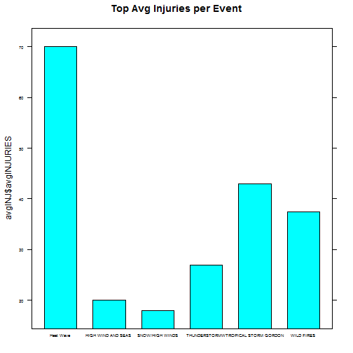
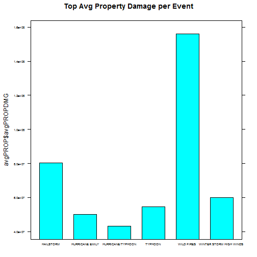

# Analysis of Storm Data by Injuries, Damage, etc done by Storm Events

## Here Storm Data from 1950-2011 is review. Data comes from NOAA's Storm Data data set. Data is aggregated and averaged by Event type to see events have the greatest impact.


### Data Sourcing

Here, the data is loaded from the original NOAA Storm Data file. Additionally, functions needed to produce the analysis and graphs are put here.


```r
memory.limit(8190)
```

```
## [1] 8190
```

```r
filename<-"repdata-data-StormData.csv.bz2"
load<-read.csv(filename, header=TRUE,stringsAsFactors=FALSE)
data<-load
rm(load)
rm(filename)
##Multiplication
mult<-function(a,b)
{

a*b

}

## Translate damage units

getmultiplier<-function(a)
{
res<-1

if(identical(a,""))
	res<-1
else if(identical(a,"-"))
	res<-1
else if(identical(a,"?"))
	res<-1
else if(identical(a,"+"))
	res<-1
else if(identical(a,"0"))
	res<-1
else if(identical(a,"1"))
	res<-10
else if(identical(a,"2")||identical(a,"h")||identical(a,"H"))
	res<-100
else if(identical(a,"3")||identical(a,"K")||identical(a,"k"))
	res<-1000
else if(identical(a,"4"))
	res<-10000
else if(identical(a,"5"))
	res<-100000
else if(identical(a,"6")||identical(a,"m")||identical(a,"M"))
	res<-1000000
else if(identical(a,"7"))
	res<-10000000
else if(identical(a,"8"))
	res<-100000000
else if(identical(a,"9"))
	res<-1000000000
else
	res<-1
res
}
```

### Data Processing

In the data processing the data is seperated into subsets for the human impact the events have, and the impact on property and crops.
Also the data is evaluated for total impact per storm event type, and average impact for storm event type.


```r
impact<-data.frame(data$STATE,data$TIME_ZONE,data$EVTYPE,data$BGN_DATE,data$END_DATE,data$FATALITIES, data$INJURIES, stringsAsFactors=FALSE)

 materialimpact<-data.frame(data$EVTYPE,data$PROPDMG, data$PROPDMGEXP, data$CROPDMG,data$CROPDMGEX,stringsAsFactors=FALSE)
rm(data)

aggFATALITIES<-aggregate(impact$data.FATALITIES,list(impact$data.EVTYPE),sum)
names(aggFATALITIES)<-c("EVTYPE","TOTALFATALITIES")
aggFATALITIES<-aggFATALITIES[order(-aggFATALITIES$TOTALFATALITIES),]
aggFATtopsix<- aggFATALITIES$TOTALFATALITIES[6]


aggINJURIES<-aggregate(impact$data.INJURIES,list(impact$data.EVTYPE),sum)
names(aggINJURIES)<-c("EVTYPE","TOTALINJURIES")
aggINJURIES<-aggINJURIES[order(-aggINJURIES$TOTALINJURIES),]
aggINJtopsix<- aggINJURIES$TOTALINJURIES[6]

avgFATAL<-aggregate(impact$data.FATALITIES,list(impact$data.EVTYPE),mean)
names(avgFATAL)<-c("EVTYPE","avgFATALITIES")
avgFATAL<-avgFATAL[order(-avgFATAL$avgFATALITIES),]
avgFATtopsix<- avgFATAL$avgFATALITIES[6]

avgINJ<-aggregate(impact$data.INJURIES,list(impact$data.EVTYPE),mean)
names(avgINJ)<-c("EVTYPE","avgINJURIES")
avgINJ<-avgINJ[order(-avgINJ$avgINJURIES),]
avgINJtopsix<- avgINJ$avgINJURIES[6]
```


```r
gc()
```

```
##            used (Mb) gc trigger  (Mb) max used  (Mb)
## Ncells   297560 15.9    1748632  93.4  2135897 114.1
## Vcells 11496039 87.8   56077780 427.9 87499462 667.6
```

```r
materialimpact$Pmultiplier<-rep(NA,length(materialimpact[[1]]))
materialimpact$Cmultiplier<-rep(NA,length(materialimpact[[1]]))
materialimpact$Pabs<-rep(NA,length(materialimpact[[1]]))
materialimpact$Cabs<-rep(NA,length(materialimpact[[1]]))


materialimpact$Pmultiplier<-sapply(materialimpact$data.PROPDMGEXP,getmultiplier)
materialimpact$Cmultiplier<-sapply(materialimpact$data.CROPDMGEX,getmultiplier)


materialimpact$Pabs<-as.numeric(materialimpact$data.PROPDMG) * as.numeric(materialimpact$Pmultiplier)

materialimpact$Cabs<-as.numeric(materialimpact$data.CROPDMG) * as.numeric(materialimpact$Cmultiplier)


aggPROP<-aggregate(materialimpact$Pabs,list(materialimpact$data.EVTYPE),sum)
names(aggPROP)<-c("EVTYPE","TOTALPROPDMG")
aggPROP<-aggPROP[order(-aggPROP$TOTALPROPDMG),]
aggPROPtopsix<- aggPROP$TOTALPROPDMG[6]


aggCROP<-aggregate(materialimpact$Cabs,list(materialimpact$data.EVTYPE),sum)
names(aggCROP)<-c("EVTYPE","TOTALCROPDMG")
aggCROP<-aggCROP[order(-aggCROP$TOTALCROPDMG),]
aggCROPtopsix<- aggCROP$TOTALCROPDMG[6]

avgPROP<-aggregate(materialimpact$Pabs,list(materialimpact$data.EVTYPE),mean)
names(avgPROP)<-c("EVTYPE","avgPROPDMG")
avgPROP<-avgPROP[order(-avgPROP$avgPROPDMG),]
avgPROPtopsix<- avgPROP$avgPROPDMG[6]

avgCROP<-aggregate(materialimpact$Cabs,list(materialimpact$data.EVTYPE),mean)
names(avgCROP)<-c("EVTYPE","avgCROPDMG")
avgCROP<-avgCROP[order(-avgCROP$avgCROPDMG),]
avgCROPtopsix<- avgCROP$avgCROPDMG[6]
```


### Data Visualization

Here the average injuries for the top storm event type are plotted.
The event ' r avgINJ$EVTYPE' has the highest average injuries at ' r avgINJ$avgINJURIES'


```r
library(lattice)
```

```
## Warning: package 'lattice' was built under R version 3.1.3
```

```r
barchart(avgINJ$avgINJURIES~avgINJ$EVTYPE,avgINJ,subset=avgINJ$avgINJURIES>=avgINJ$avgINJURIES[6],main=c("Top Avg Injuries per Event"), scales=list(cex=.50))
```

 

```r
barchart(avgPROP$avgPROPDMG~avgPROP$EVTYPE,avgPROP,subset=avgPROP$avgPROPDMG>=avgPROP$avgPROPDMG[6],main=c("Top Avg Property Damage per Event"),scales=list(cex=.50))
```

 

### Results

Here we can see the events that have the greatest total and average fatalities, injuries, property damage, and crop damage.

#### Events with the greatest total fatalities

```r
head(aggFATALITIES)
```

```
##             EVTYPE TOTALFATALITIES
## 834        TORNADO            5633
## 130 EXCESSIVE HEAT            1903
## 153    FLASH FLOOD             978
## 275           HEAT             937
## 464      LIGHTNING             816
## 856      TSTM WIND             504
```
#### Events with the greatest total injuries

```r
head(aggINJURIES)
```

```
##             EVTYPE TOTALINJURIES
## 834        TORNADO         91346
## 856      TSTM WIND          6957
## 170          FLOOD          6789
## 130 EXCESSIVE HEAT          6525
## 464      LIGHTNING          5230
## 275           HEAT          2100
```
#### Events with the greatest average fatalities

```r
head(avgFATAL)
```

```
##                         EVTYPE avgFATALITIES
## 842 TORNADOES, TSTM WIND, HAIL     25.000000
## 72               COLD AND SNOW     14.000000
## 851      TROPICAL STORM GORDON      8.000000
## 580      RECORD/EXCESSIVE HEAT      5.666667
## 142               EXTREME HEAT      4.363636
## 279          HEAT WAVE DROUGHT      4.000000
```
#### Events with the greatest average injuries

```r
head(avgINJ)
```

```
##                    EVTYPE avgINJURIES
## 277             Heat Wave        70.0
## 851 TROPICAL STORM GORDON        43.0
## 954            WILD FIRES        37.5
## 821         THUNDERSTORMW        27.0
## 366    HIGH WIND AND SEAS        20.0
## 656       SNOW/HIGH WINDS        18.0
```
#### Events with the greatest total property damage

```r
head(aggPROP)
```

```
##          EVTYPE TOTALPROPDMG
## 834     TORNADO  51647380682
## 170       FLOOD  22157709930
## 153 FLASH FLOOD  15822673980
## 244        HAIL  13935267515
## 402   HURRICANE   6168319016
## 856   TSTM WIND   4484928495
```
#### Events with the greatest average property damage

```r
head(avgPROP)
```

```
##                      EVTYPE avgPROPDMG
## 954              WILD FIRES  156025000
## 271               HAILSTORM   80333333
## 973 WINTER STORM HIGH WINDS   60000000
## 879                 TYPHOON   54566364
## 405         HURRICANE EMILY   50000000
## 411       HURRICANE/TYPHOON   43248183
```
#### Events with the greatest total crop damage

```r
head(aggCROP)
```

```
##           EVTYPE TOTALCROPDMG
## 95       DROUGHT  12472566002
## 170        FLOOD   5661968450
## 244         HAIL   3025954473
## 402    HURRICANE   2741910000
## 153  FLASH FLOOD   1421317100
## 140 EXTREME COLD   1292973000
```
#### Events with the greatest average property damage

```r
head(avgCROP)
```

```
##                      EVTYPE avgCROPDMG
## 136       EXCESSIVE WETNESS  142000000
## 73  COLD AND WET CONDITIONS   66000000
## 87          DAMAGING FREEZE   43683333
## 121             Early Frost   42000000
## 406          HURRICANE ERIN   19430000
## 182        FLOOD/RAIN/WINDS   18800000
```

### Discussion

#### The EVTYPE column
The EVTYPE columns contains many events that seem similar in description and may be references to the exact same event, as well as some miss-spellings that may misrepresent some events. Aligning event descriptions to more common events or to correctly spelled events is not something you can "teach" a computer without hard-coding a substitution table. Accurately cleaning the EVTYPE data requires more research into the habits and knowledge of the people who originally noted the Storm Data data or more research to develop a Natural Language Processing(NLP) algorithm. Changing the source data will only introduce a researcher bias, different persons will group "WIND" type events differently. However, plotting and analysing the original data will reveal what events were most damaging while preserving the bias of those who noted the data originally. Thus, our analysis will be based on descriptions from original NOAA persons with greater Storm Data prior knowledge. Through the data analysis, we see what events those NOAA persons favor. 


